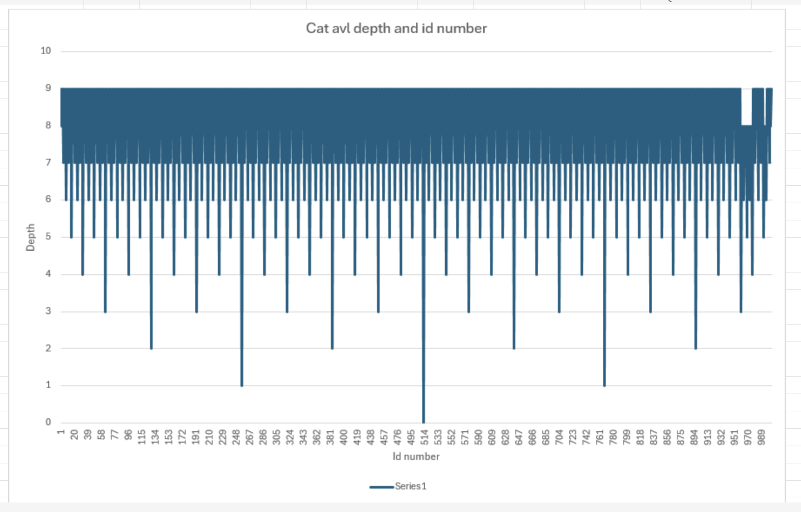
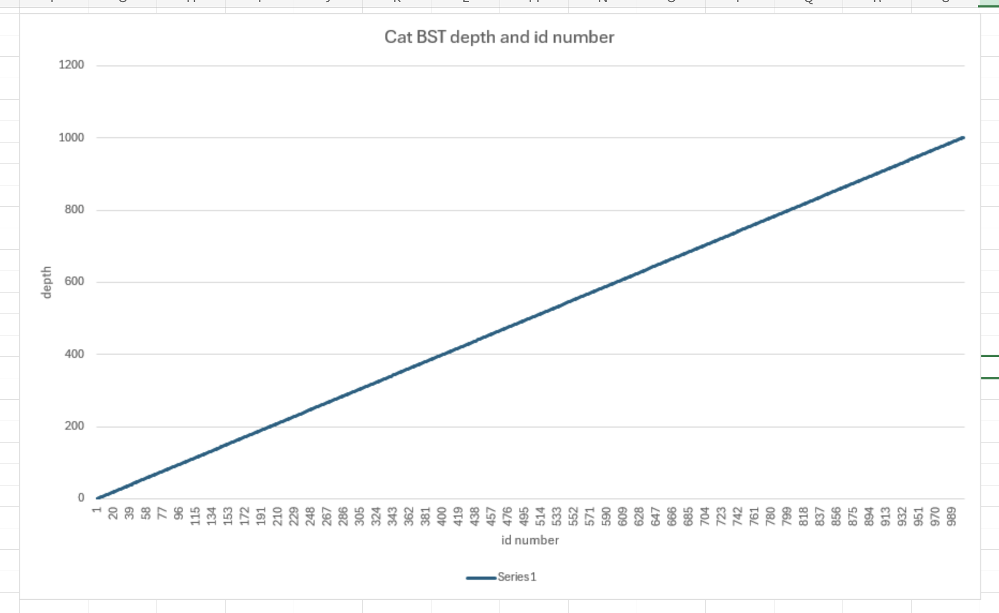
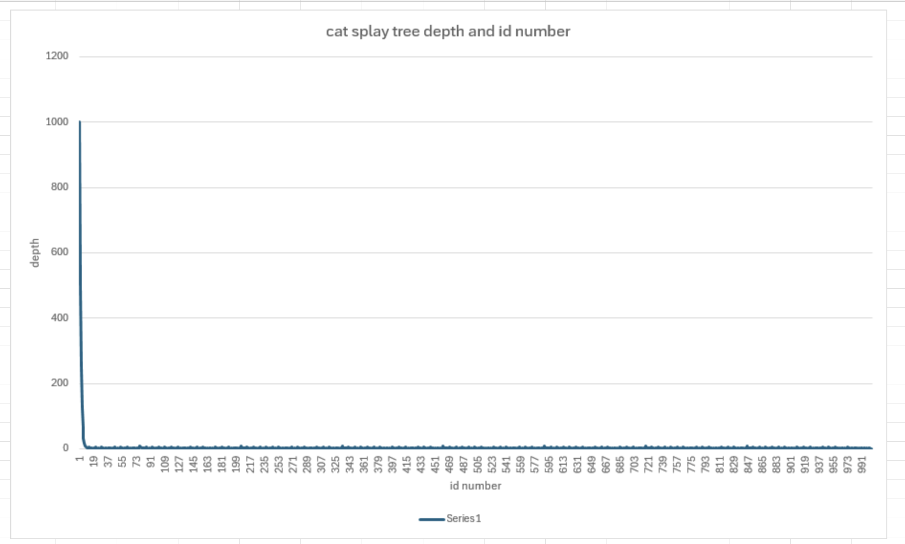

# Project 3 Report

Answer the following questions directly in this file:
* You will have a different grader again, so make sure your report includes information about your dataset.

Its about cats 
EX: 
&nbsp; Id, Breed, Age (Years), Weight (kg), Color, Gender 
&nbsp; 1, Russian Blue, 19, 7, Tortoiseshell, Female

* How do the depths of the random-ordered integers compare to the depths of the ordered integers for each tree? Why?

BST: 
        &nbsp; The in order integers are in a very lopsided tree because they all go to the right.
        &nbsp; The random integers are in a better order because they are not all going to the right.

AVL: 
        &nbsp; The random and ordered integers are about the same because AVL self balances.

Splay:  
       &nbsp;  The random and ordered integers are about the same because 

        
* How do the depths of each custom-data-type tree compare to each other?

BST:  
       &nbsp;  It has the lopsided issue still.

AVL: 
       &nbsp;  It is very consitent and a lot better than BST.

Splay:  
      &nbsp;   It starts off very deep then fixes itself and consistently had lower depth and BST and AVL.

* Why do the depths of the second custom-data-type Splay Tree make sense?

It makes sense because the splay tree moves the node up to the top when it is access so it will always be 0 if you acess it twice in a row.

* Graph the Binary Search Tree, AVL Tree, and Splay Tree depths for the custom data type trees. Do not use C++ to graph, you can use whatever spreadsheet application or graphical programming language you prefer. You can use whatever graph is most readable to you (e.g. scatter plot, histogram, etc.).

* Compare and contrast the graphs and explain the differences based on what you know about the structure and behavior of the trees. Justify the time complexity of searching the trees based on the results.

BST:  
       &nbsp;  BST worst case search is O(n) as you can see in the graph. This is because it doesn't balance itself.

AVL:  
       &nbsp;  AVL worst case search is O(logn) as you can see in the graph. This is because it balances itself.

Splay:  
      &nbsp;   Splay worst case search is O(n) as you can see in the beginning part of the graph. This is because it doesn't self balence so in the beginning before querying a bunch its like a lopsided BST.

**Note: Any code that was not authored by yourself or the instructor must be cited in your report. This includes the use of concepts not taught in lecture.**